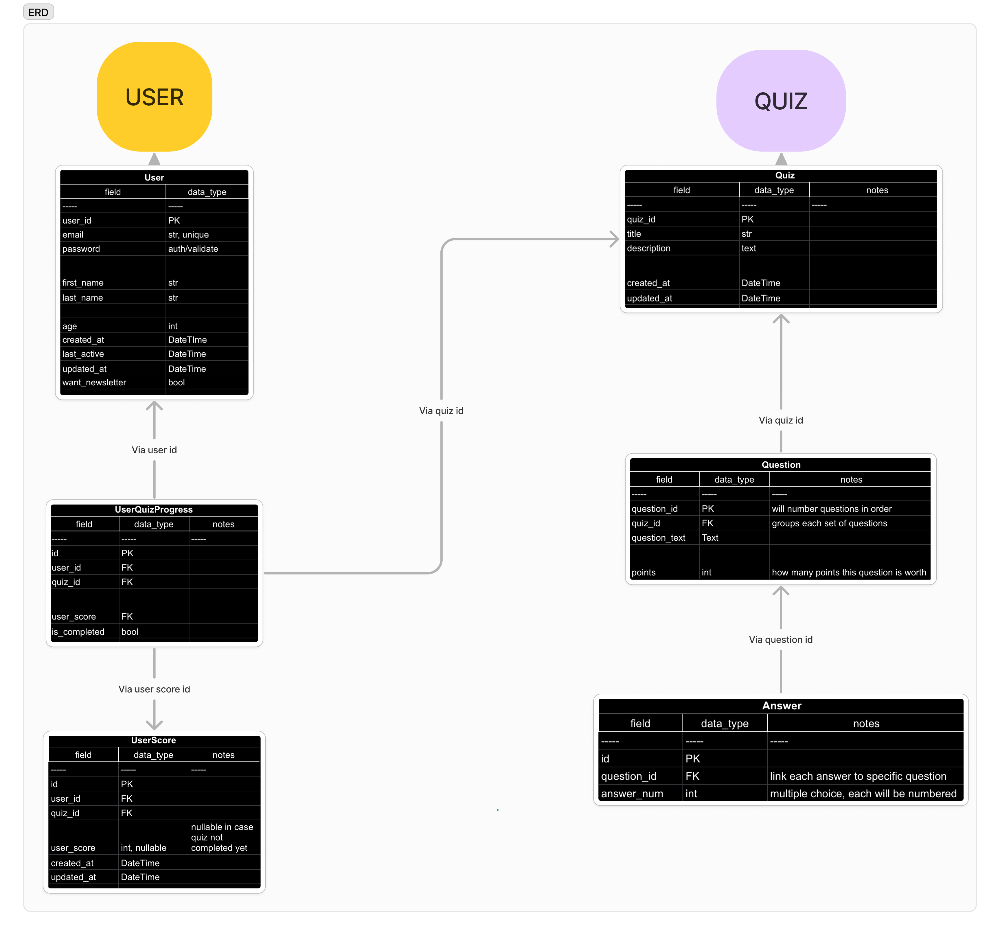

# TheoryHub 🎵✨
### *Your Pathway to Musical Excellence*

[Django Version]
[Python Version]
[License]

The TheoryHub is an online platform designed to help users prepare for music theory exams, specifically for ABRSM grade 5. Built with Django, this web application provides a comprehensive set of quizzes and resources to enhance your understanding of music theory concepts essential for your musical progress and required by ABRSM for grades 6 and above performance exams.

## Features ✨ 

<details>
<summary>Open Features ✨</summary>


- **User Authentication** 🔒: Sign up for an account to access personalized features and track your progress.
- **Quiz Library** 📚: Explore a wide range of quizzes formatted just like the real newly-formatted grade 5 theory exams online for ABRSM.
- **Interactive Quizzes** ✏️: Take quizzes with multiple-choice questions and receive instant feedback on your performance.
- **Progress Tracking** 📈: Monitor your progress through a user-friendly dashboard, displaying your quiz attempts, scores, and overall performance.
- **Admin Panel** 🔑: Administrators can create new quizzes, manage user accounts, and view quiz analytics.

</details>

## Database Architecture 

<details>
<summary>Database Architecture</summary>


The ERD ([available here](#appendix)) shows two main concepts: the user and the quizzes. Within each, each model is designed to handle quizzes with individual questions, answers and user scores for users to track their progress, and for admins to track user success rates for future features. This modular approach ensures that each model handles its data in a self-contained manner, ensuring future scalability and ease of custom database queries where necessary for future development. 


## Database Design and Entity Relationship Diagram (ERD)

The application's database design follows a modular approach, centered around two core entities: Users and Quizzes. This architecture ensures a clear separation of concerns, allowing each entity to handle its respective data in a self-contained and scalable manner.

The ERD illustrates the relationships between these entities and their associated models:


### User Entity

The User entity encompasses models responsible for managing user accounts, authentication, and progress tracking. Key models include:

- **User**: Stores user profile information, such as name, email, and credentials.
- **UserProgress**: Tracks individual user performance, including quiz attempts, scores, and overall progress.

This modular design allows for planned future enhancements, such as implementing user roles, permissions, and gamification elements like leaderboards or achievement badges.

### Quiz Entity

The Quiz entity is comprised of models dedicated to managing quizzes, questions, and answer options. Key models include:

- **Quiz**: Represents a collection of questions.
- **Question**: Stores the question text and associated metadata.
- **Answer**: Holds the answer options for each question, including the correct answer.

This separation of concerns facilitates future scalability, enabling features like dynamic quiz generation for personalised user progression plans based on topics needing most improvement, question randomization, and advanced analytics for question performance and difficulty analysis.

</details>


<details>
<summary>Future Enhancements</summary>

## Future Database Enhancements
The modular design of the database schema lays a solid foundation for future enhancements and expansions. 
See [Future Features](#future-features) for projected future features list (non-exhaustive).


By adhering to best practices in database design and leveraging a modular approach, the application's codebase remains maintainable and extensible, ensuring a solid foundation for continuous improvement and feature additions. 
Others are encouraged submit future feature suggestions on this repository, for future collaboration!

</details>

## Future Features 

<details>
<summary>Open Future Features</summary>

- **User Roles**: Map users to specific roles to host integrated forums and discussions on different topics for improved social connection.
- **UI Personalisation**: Personalised user interface features for a more dyslexia-friendly service.
- **Gamification Elements**: User models include futher metadata to enable leaderboards or achievement badges and timed competitions for various ages groups.
- **Curriculum Integration**: Mapping quizzes to specific ABRSM music theory curricula or exam requirements, enabling targeted preparation and progress tracking.
- **Social Features**: Introducing study groups, forums, or collaborative learning features to foster community engagement and knowledge sharing.
- **Adaptive Learning**: Implementing algorithms for personalized question recommendations based on user performance and learning patterns.
- **Multimedia Support**: Incorporating multimedia elements, such as audio clips or sheet music, to enhance the learning experience.

</details>

## Getting Started 

<details>
<summary>Getting Started 🚀</summary>

To get a local copy of the project up and running, follow these steps:

1. Clone the repository:
   ```
   git clone https://github.com/your-username/music-theory-practice-hub.git
   ```

2. Navigate to the project directory:
   ```
   cd music-theory-practice-hub
   ```

3. Create a virtual environment and activate it:
   ```
   python -m venv env
   source env/bin/activate  # On Windows, use `env\Scripts\activate`
   ```

4. Install the required dependencies:
   ```
   pip install -r requirements.txt
   ```

5. Apply database migrations:
   ```
   python manage.py migrate
   ```

6. Start the development server:
   ```
   python manage.py runserver
   ```

7. Open your web browser and visit `http://localhost:8000` to access the Music Theory Practice Hub.

</details>

<details>
<summary>Contributing 🤝</summary>

We welcome contributions from the community! If you'd like to contribute to the project, please follow these steps:

1. Fork the repository.
2. Create a new branch for your feature or bug fix.
3. Make your changes and commit them with descriptive commit messages.
4. Push your changes to your forked repository.
5. Submit a pull request to the main repository.

### Suggestions and Future Enhancements 💡

We are constantly striving to improve the Music Theory Practice Hub and make it more engaging and effective for users. If you have any suggestions for additional features or scalable enhancements, please feel free to submit them as issues in the repository. We welcome collaboration and ideas from the community to shape the future of this platform.

Some potential areas for future development include:

- Gamification elements (e.g., badges, leaderboards) to increase user engagement and motivation.
- Integration with specific music theory curricula or exam requirements.
- Social features (e.g., study groups, forums) to foster collaboration and knowledge sharing among users.

If you have expertise or interest in any of these areas, we encourage you to get involved and contribute to the project's growth.

</details>

## License 📄

<details>
<summary>Open License 📄</summary>

This project is licensed under the [MIT License](LICENSE).

</details>

<details>
<summary>Acknowledgments 🙏</summary>

- [Django](https://www.djangoproject.com/) - The web framework used for this project.
- [Python](https://www.python.org/) - The programming language used for this project.
- [Bootstrap](https://getbootstrap.com/) - The CSS framework used for styling.

Feel free to explore the Music Theory Practice Hub and enhance your music theory skills! If you have any questions, suggestions, or ideas for future enhancements, please don't hesitate to reach out or submit an issue. Happy practicing! 🎶

</details>

Now, each main heading in your README file is a collapsible dropdown section. Users can click on the section header to expand or collapse the content within that section.

Note that this approach uses HTML tags within your Markdown file, which may not be supported by all Markdown renderers or platforms. However, it should work correctly on platforms like GitHub, GitLab, and certain static site generators that support HTML rendering within Markdown files.

# Appendix

<details>
<summary>
Entity Relationship Diagram (ERD)

*[(Back to Database Architecture Section)](#database-architecture)*

</summary>



</details>

[Back to Top](#your-pathway-to-musical-excellence)