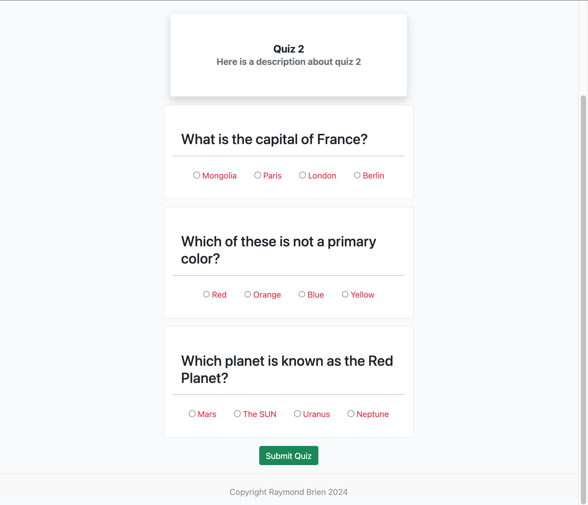
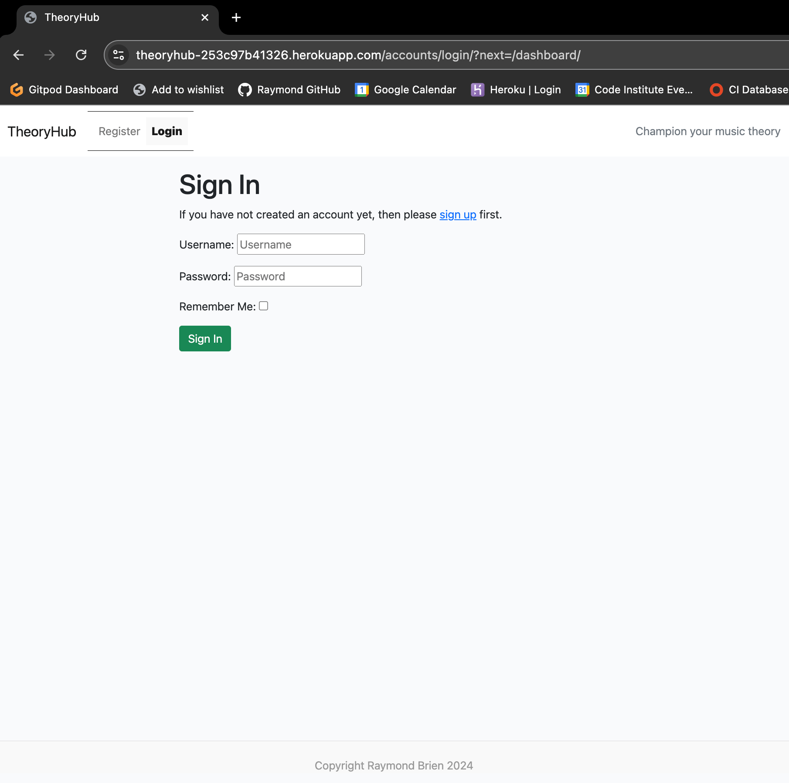
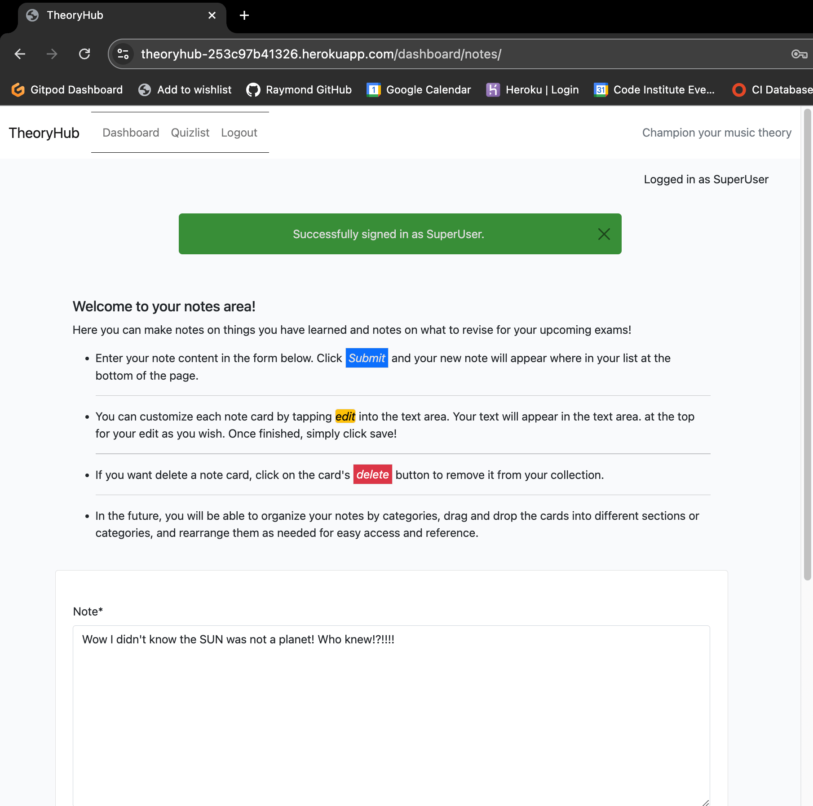
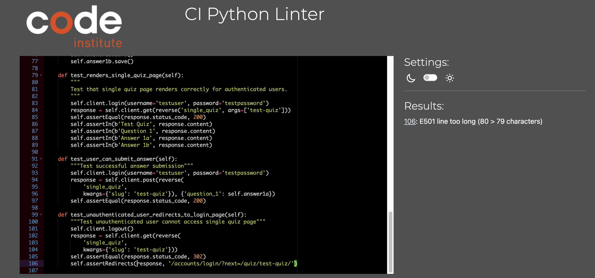

# Testing

> [!NOTE]  
> Return back to the [README.md](README.md) file.

# Feature-by-Feature Testing

## Navigation

### Description
Ensures smooth transitions between pages and that all links direct users to the correct destinations.

### Testing Process
1. **Access the Main Navigation Menu**: Clicking on each link in the navigation menu to ensure it leads to the correct page (Home, QuizList, Quizzes, Dashboard).
2. **Internal Page Links**: Testing all internal page links to verify they navigate to the intended sections within the same page.
3. **Browser Navigation**: Using the browser's back and forward buttons to ensure they function properly without breaking the page.

### Results
- All navigation links direct to the correct pages or sections.
- Links work as expected and open in the appropriate tab.
- Navigation is be intuitive and consistent across different pages.

## Responsive Design

### Description
Verifies compatibility across various devices and screen sizes, ensuring the site is usable on mobile phones, tablets, and desktops.

### Testing Process
1. **Browser Resize**: Manually resizing the browser window to test how the layout adapts to different screen sizes (e.g., mobile, tablet, desktop).
2. **Device Emulators**: Using device emulators in browser developer tools to test responsiveness on specific devices (e.g., iPhone, Android phones, tablets).
3. **Physical Devices**: Testing the website on actual physical devices where possible to ensure the design is functional and visually appealing across a range of devices.

### Expected Results
- The site layout adjusts correctly and be fully functional on various screen sizes.
- Content is legible, and interactive elements should be accessible without distortion.
- No horizontal scrolling necessary on mobile devices.

### Results
- The site layout adjusts correctly is fully functional on a variety of screen sizes and devices
- Content is legible, and interactive elements should be accessible without distortion

## Quiz and Dashboard Displays

### Description
Ensure that quizzes and templates are showcased properly with accurate descriptions, images, and links.

### Testing Process
1. **Object listings**: Check that all items listed on the page have accurate descriptions, images, and any associated links.
2. **Link Functionality**: Test all project links to ensure they lead to the correct project pages or external sites.
3. **Content Alignment**: Ensure that text and images are properly aligned and formatted according to design specifications.

### Expected Results
- All quizzes, questions, answer options, quiz notes and user data tables should be displayed with correct descriptions, formatting, images, and links.

### Results
- All elements of quizzes and dashboard interactivity is formatted correctly and as expected.

## User Experience Testing:

- In usability testing, two users have accessed content using test user accounts on iphone and ipad early in the development process. Discoverability issues were raised with messages and issues were fixed.

- Accessibility testing confirmed compliance with accessibility standards screen reader compatibility, proper alt text for images and keyboard navigation using Axe Devtools accessibility testing.

## Compatibility Testing:

- Browser Compatibility: Testing on different browsers (Chrome, Firefox, Safari, Edge, etc.) to ensure consistent performance.
- Device Compatibility: Ensuring functionality across various devices (desktops, laptops, tablets, and mobile phones).
- Performance Testing (this will be tested once the site has grown past MVP state):
	- Speed and Load Testing: Tools like PageSpeed Insights or GTmetrix to check page load times and optimize where necessary.
	- Scalability Testing: Assess how the site handles increased traffic or usage.

## Regression Testing:

After implementing fixes or updates, I ensured that previous features and functionalities still work as intended. This prevents new changes from breaking existing features.

# Documentation and Logs:

## Code Validation

All relevant project files have been validated, for HTML, CSS, JavaScript and Python to ensure accessibility and good coding practices are met using:
- https://validator.w3.org/
- https://jigsaw.w3.org/css-validator/
- https://jshint.com/
- https://pep8ci.herokuapp.com/

| Language/File         | Image                                                                                  | Result |
|------------------|---------------------------------------------------------------------------------------------|------|
| HTML             |                 | Yes  |
| CSS              |                   | Yes  |
| JS (edit_note.js)       |  | Yes  |
| JS (quiz.js)       |            | Yes  |

## Browser Compatibility

I have run tests using the following browsers:
- [Chrome](https://www.google.com/chrome)
- [Safari](https://support.apple.com/downloads/safari)
- [Opera](https://www.opera.com/download)

I've tested my deployed project on multiple browsers to check for compatibility issues.

| Browser | Home | QuizList | Dashboard | Single Quiz | Notes |
| --- | --- | --- | --- | --- | --- |
| Chrome |  |  |  |  | Works as expected |
| Safari |  |  |  |  | Works as expected |
| Opera |  |  |  |  | Works as expected |

## Responsiveness

I have tested my deployed project on multiple physical and virtual devices to check for responsiveness issues.

| Device | Home | Quiz List | Single Quiz | Dashboard | Notes Page | Results |
| --- | --- | --- | --- | --- | --- | --- |
| Mobile (iPhone 13, Opera) |  |  |  |  |  | Works as expected |
| Tablet (iPad 12", Safari) |  |  |  |  |  | Works as expected |
| Desktop (Mac, Chrome) |  |  |  |  |  | Works as expected |
| XL Monitor |  |  |  |  |  | Scaling starts to have minor issues |

## Lighthouse Audit

I have tested my deployed project using the Lighthouse Audit tool to check for any major issues.

I have tested my deployed project using the Lighthouse Audit tool to check for any major issues.

| Page | Mobile | Desktop | Notes |
| --- | --- | --- | --- |
| Home |  |  | Some minor warnings |
| Quiz List |  |  | Some minor warnings |
| Single Quiz |  |  | Some minor warnings |
| Dashboard |  |  | Some minor warnings. As a future feature, the dashboard will be styled to include improved contrast for user data for accessibility. |
| Notes Page |  |  | Some minor warnings |

## Defensive Programming

Defensive programming was manually tested with the below user acceptance testing:

| Page | Expectation | Test | Result | Fix | Screenshot |
| --- | --- | --- | --- | --- | --- |
| Home | | | | | |
|  | Quiz list page is expected to load on 'getting started' button click | Tested the feature by doing clicking button | The feature behaved as expected, and it did redirect to quiz list. | Test concluded and passed |  |
|  | Button click for 'getting started' is expected to redirect to login page if user is not logged in | Tested the feature by logging out and clicking button | Redirected to login page as expected | Test concluded and passed |  |
|  | Global navigation should be accessible via burger icon to avoid screen overcrowding | Tested on mobile in devtools and on iphone | Burger icon for navbar appears as expected | Test concluded and passed |  |
| Quiz List | | | | | |
|  | Button click for specific quiz expected to redirect to specific quiz | Tested the feature by clicking on buttons available in quiz list when logged in | The feature behaved as expected, and it did redirect to specific quiz | Test concluded and passed |  |
|  | Quiz url is not intended to be accessible by brute force for unauthenticated users | Tested the feature by logging out and entering a single quiz url manually | Feature redirected to sign in page as expected. | Test concluded and passed. |  |
|  | If accessing single quiz url and not logged in, user should be redirected to single quiz once logging in from the login page | Tested the feature by logging out and entering a single quiz url manually, then logging in | Feature redirected to sign in page as expected, then directly to desired quiz url | Test concluded and passed. |  |
| Single Quiz | | | | | |
|  | Upon clicking start quiz on a single quiz page, the quiz is revealed and a list of questions are presented with a submit button at the bottom. First question should scroll into view and starting information box should become smaller | Tested the feature by starting a quiz | The feature behaved as expected | Test concluded and passed |  |
|  | Users should be able to submit quiz only when all the questions have been answered. | Attempted to submit quiz without answering all questions | The unanswered questions were highlighted and quiz submission was not successful, as expected | Test concluded and passed |  |
|  | Users should be redirected to quiz result page once valid quiz answers are submitted, showing their score for that quiz | Tested the feature by completing a quiz | Redirect to quiz result page with score as expected | Test concluded and passed |  |
| Dashboard | | | | | |
|  | Dashboard should only be available for authenticated users | Tested the feature by logging out and brute forcing via url to dashboard | Redirect to login page occured instead, as expected | Test concluded and passed |  |
|  | Dashboard should only display users' own quiz score data | Tested the feature by completing a quiz, noting the result and checking the dashboard to confirm the result was showing | The dashboard listed latest quiz result as expected | Test concluded and passed |  |
| Notes Page | | | | | |
|  | Notes page should only be available for authenticated users | Tested the feature by logging out and brute forcing url to notes page | Redirect to login occurred as expected | Test concluded and passed |  |
|  | Notes should only display users' own notes | Tested the feature by making a new note as another user (user B). Logged back in as user A to confirm user B's note was note displaying for user A | Only user A's own notes were displayed. User B's notes were only available for user B to see. | Test concluded and passed |  |
|  | A note edit button should display note content in form, form should scroll into view and user can submit an edit successfully with a confirmation message for user feedback. The notes page should now display the edited note for that user | Tested the feature by clicking edit and making an edit to a note | The note content was editable and upon saving, the new note displayed as expected | Test concluded and passed |  |
|  | Users should be able to delete a note, with a confirmation message | Tested the feature by deleting a note | The confirmation delete modal displayed as expected. The note was successfully deleted and no longer displayed on the user's notes page | Test concluded and passed |  |
| Additional Defenses | | | | | |
|  | Navigation bar should be listed at top (not burger icon, like for mobile users) | Tested the feature by opening the same page as both logged in and logged out | The feature displayed as expected | Test concluded and passed |  |
|  | Clicking browser back button should not break the site, nor allow users to access content once logged out, even if previously logged in. | Tested the feature by logging out and pressing back button. | Briefly showed page before redirecting to login page. Further view authentication and a next element in the redirect was added. Tested again for all pages and now completely secure, redirecting immediately to login, then the desired page, as expected | Test concluded and passed |  |

## User Story Testing

Each user story has been tested and documented below. Any open user stories are listed in the future features milestone (milestone 8).

| User Story | Screenshot |
| --- | --- |
| User can delete a quiz note |  |
| User can edit a note |  |
| User can make notes on a notes page |  |
| User initiates media and actions |  |
| User information is pre-filled |  |
| User can view progress details |  |
| User can access progress dashboard |  |
| User can submit quiz answers |  |
| User can start a quiz |  |
| User can view quiz list |  |
| User can create account |  |
| User can access sign-up form |  |
| Admin can edit quiz answers |  |
| Admin can edit quiz questions |  |
| Admin can delete user accounts |  |
| Admin can view user details |  |
| Admin can access user accounts list | |
| Admin can save and publish quiz |  |
| Admin can add multiple-choice questions |  |
| Admin can set quiz title and description |  |

## Automated Testing

I have conducted a series of automated tests on my application.

I fully acknowledge and understand that, in a real-world scenario, an extensive set of additional tests would be more comprehensive.

### Python (Unit Testing)

I have used the pytest library to run my automated tests globally for my application and all have returned successfully.

Please see the documentation here:

As an alternative I could have also used Django's built-in unit testing framework to test the application functionality, but I chose pytest for improved readability.

Should you wish to use the build in testing framework from Django, please follow the instructions.

In order to run the tests, I run the following command in the terminal each time:

`python3 manage.py test name-of-app`

The global report of my django tests are as all returning complete:

#### Unit Test Issues

I acknowledge that there is a warning with pytest showing a database configuration error - this is because I have not enabled pytest to write directly to my database, and instead have directed it to use sqlite3 which comes preinstalled with django projects instead, to preserve database configuration and safety.

This was arranged in a pytest.ini file and settings:
pytests.ini file:
1[screenshot](./static/images/documentation/validation/global-tests-ini.png)
settings:
1[screenshot](./static/images/documentation/validation/global-tests-ini2.png)

## Bugs

Validation and delinting tests were run globally, for all HTML, CSS, JavaScript, and Python files that were my own.

Results:

Python

- 
- 
- 
- 
- 
- 
- 
- 
- 
- 
- 
- 
- 
- 
- 
- 
- 
- 
- 
- 

- Python `E501 line too long` (106 > 79 characters)

    

    - To fix this, I indented after the bracket for a new line whilst maintaining functionality.

### GitHub **Issues**

Any further issues can be found at https://github.com/RaymondBrien/theoryhub/issues

**Fixed Bugs**

All previously closed/fixed bugs can be tracked [here](https://github.com/RaymondBrien/theoryhub/issues?q=is%3Aissue+is%3Aclosed).

Any remaining open issues can be tracked [here](https://github.com/RaymondBrien/theoryhub/issues).

## Unfixed Bugs

> [!NOTE]
> There are no remaining bugs that I am aware of.

